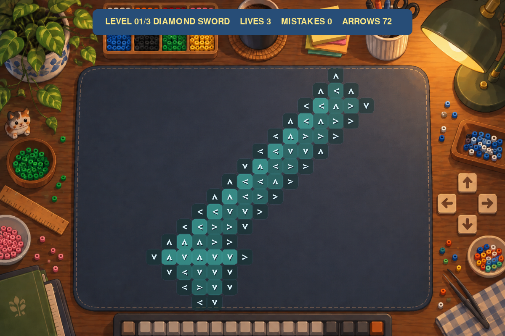
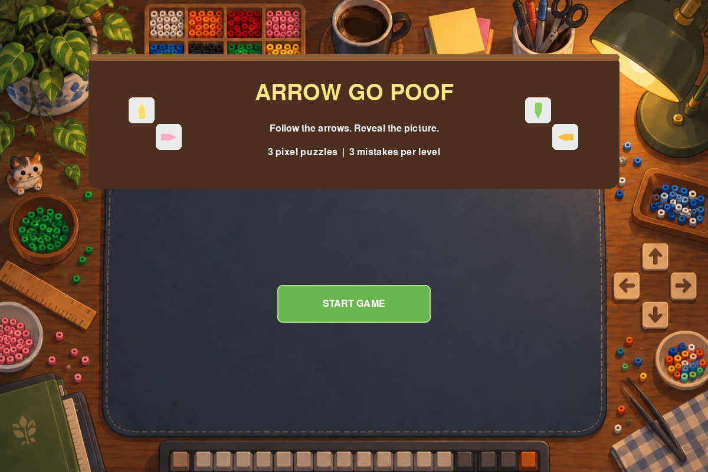
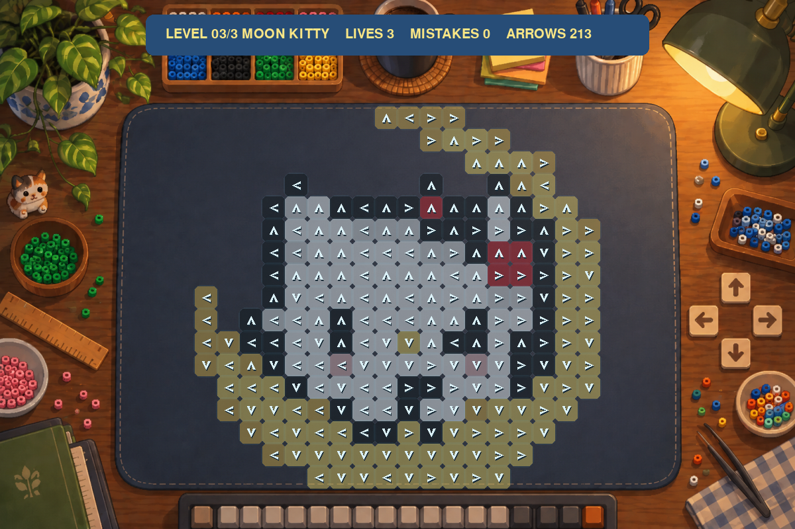
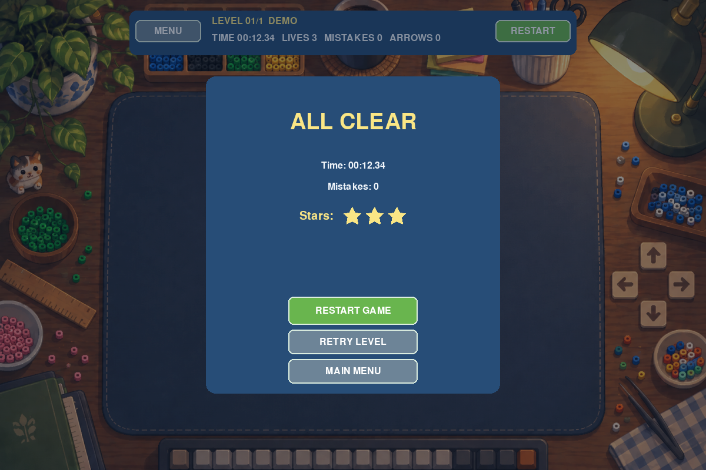

# Arrow-Go-Poof（一箭又一箭）

一个使用 Python 和 Pygame 实现的点击式箭头解谜小游戏。玩家需要按正确顺序点击箭头，让没有阻挡的箭头飞出棋盘，逐步揭开隐藏的像素图案。








## 功能

- 带装饰箭头棋盘的主界面、游戏界面、通关/失败结果界面；
- 上、下、左、右四种方向的单格箭头；
- 同行/同列路径检测和边界判断；
- 成功箭头飞出窗口的动画；
- 阻挡箭头撞击、变红、回退并保留错误标记；
- 三次失误机会，HUD 显示生命值、失误次数和剩余箭头；
- 3 个可以正常通关的关卡：16×16 DIAMOND SWORD、16×16 BEAD BALL、18×17 MOON KITTY；
- 三个拼豆关卡都使用固定的像素画颜色掩码和已冻结的方向布局；布局在设计阶段由固定种子工具生成并验证，运行时不会随机变化；
- 通关后进入下一关，失败后重开当前关，最终通关后可重新开始整局；
- 无外部商业游戏代码、美术、音效或关卡资源。

开始界面和游戏界面共用提交者提供的工作桌图片资源，文件位于 `assets/menu-background.png`；箭头棋盘会始终居中放在桌垫内。箭头使用 Pygame 绘制的居中回旋镖形方向标记，透明格可淡淡透出底层关卡颜色。三关分别根据提交者提供的钻石剑、精灵球、月亮 Hello Kitty `.px` 拼豆工程图案制作成固定网格；Hello Kitty 图案在设计阶段等比例压缩为适合游戏桌垫的 18×17 网格。

## 开发环境

- Python 3.10+
- Pygame 2.6+
- pytest 8+

## 安装

```bash
python -m pip install -r requirements.txt
```

## 运行游戏

```bash
python main.py
```

窗口固定为 1200×800。点击 `START GAME` 进入第一关；鼠标左键点击箭头；通关后点击 `NEXT LEVEL`；失败后点击 `RESTART LEVEL`；最终通关后点击 `RESTART GAME`。

## 测试

```bash
python -m pytest -v
python -m compileall -q main.py src tests
```

当前自动化测试（107 项）覆盖 Board 规则、四方向路径、三关可通关顺序、固定种子布局、动画阶段、生命值、开始/通关/失败/重开、鼠标事件路由和 UI 布局。

## 项目文档

- [课程作业报告草稿](docs/course-report.md)
- [测试计划](docs/test-plan.md)
- [AIGC 使用记录](docs/aigc-log.md)
- [第二阶段设计说明](docs/superpowers/specs/2026-09-19-playable-mvp-design.md)

## GitHub

项目仓库：<https://github.com/MieSheeeep/Arrow-Go-Poof>
