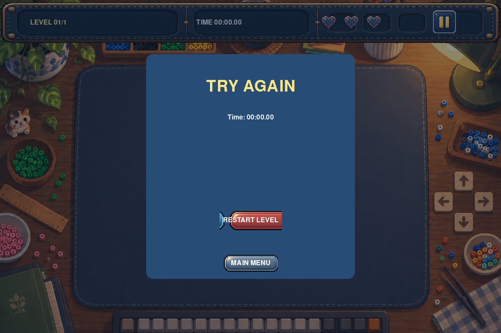
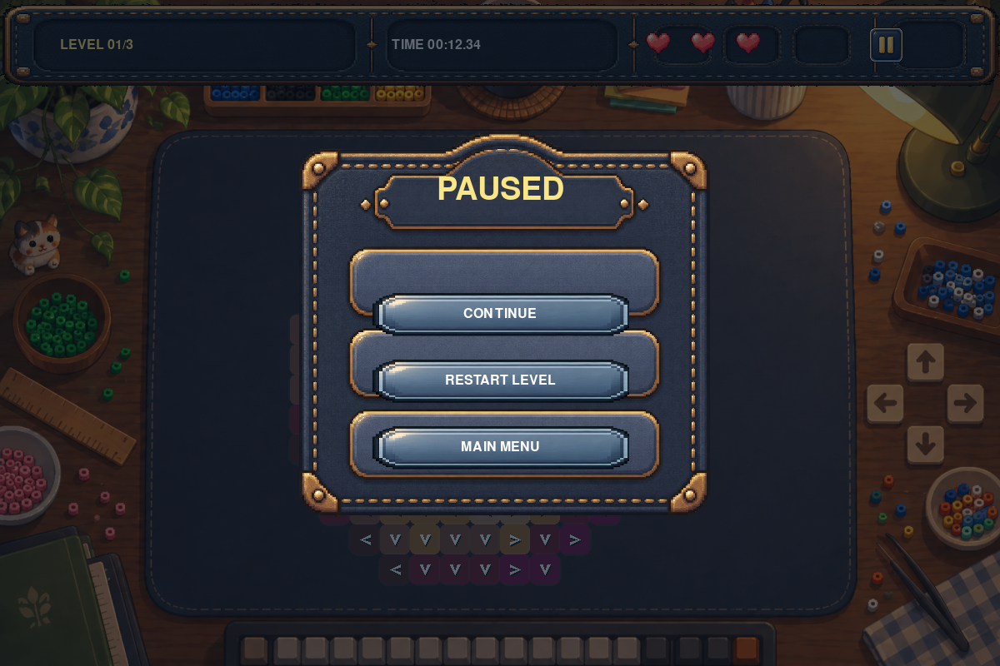

# Arrow-Go-Poof（一箭又一箭）

一个使用 Python 和 Pygame 实现的点击式箭头解谜小游戏。玩家需要按正确顺序点击箭头，让没有阻挡的箭头飞出棋盘，逐步揭开隐藏的像素图案。





## 功能

- 带装饰箭头棋盘的主界面、游戏界面、通关/失败结果界面；
- 上、下、左、右四种方向的单格箭头；
- 同行/同列路径检测和边界判断；
- 成功箭头飞出窗口的动画；
- 阻挡箭头撞击、变红、回退并保留错误标记；
- 三次生命机会以三颗像素心显示；
- 每关独立计时；开始页不计时，通关或失败后时间冻结，重开时清零；
- 根据关卡时间与失误次数结算 1～3 星：零失误并在三星时限内为 3 星；一次失误内且在二星时限内为 2 星；其余通关为 1 星；
- 3 个可以正常通关的关卡：16×16 ENCHANTED APPLE、16×16 BEAD BALL、18×17 MOON KITTY；
- 三个拼豆关卡都使用固定的像素画颜色掩码和已冻结的方向布局；布局在设计阶段由固定种子工具生成并验证，运行时不会随机变化；
- 顶部状态栏显示关卡、时间、三颗生命和暂停键；暂停菜单提供继续、重开本关和返回主菜单；通关页提供下一关、重试当前关和主菜单，失败页提供重开当前关和主菜单；
- 得分与连击：连续正确点击累计 combo 并加分，失误打断连击，HUD 实时显示得分与连击；
- 提示（HINT）：高亮一个当前可安全消除的箭头；
- 撤销（UNDO）：恢复最近一次消除的箭头，得分与连击一并回退；
- 存档/读档（SAVE/LOAD）：将当前关卡进度写入 `savegame.json` 或从该文件恢复；
- 自动求解（AUTO）：按当前可消除顺序自动连续消除，直至通关；
- 音效：飞出、碰撞、消除、失败等音效全部在运行时用波形合成，无需外部音频文件；
- 随机生成关卡：按 `R` 键从三个拼豆图案中随机挑选并生成一关可通关关卡；

开始界面和游戏界面共用提交者提供的工作桌图片资源，文件位于 `assets/menu-background.png`；箭头棋盘会始终居中放在桌垫内。箭头使用 Pygame 绘制的居中回旋镖形方向标记，半透明格可透出底层关卡颜色。三关分别根据提交者提供的附魔金苹果、精灵球、月亮 Hello Kitty `.px` 拼豆工程图案制作成固定网格；Hello Kitty 图案在设计阶段等比例压缩为适合游戏桌垫的 18×17 网格。

## 开发环境

- Python 3.10+
- Pygame 2.6+
- pytest 8+

## 安装

```bash
python -m pip install -r requirements.txt
```

## 运行游戏

```bash
python main.py
```

窗口固定为 1200×800。点击 `START GAME` 进入第一关；鼠标左键点击箭头；游戏中点击右上角暂停键，可继续游戏、重开本关或返回主界面；通关后可点击 `NEXT LEVEL`、`RETRY LEVEL` 或 `MAIN MENU`；失败后可点击 `RESTART LEVEL` 或 `MAIN MENU`；最终通关后可点击 `RESTART GAME`。

## 测试

```bash
python -m pytest -v
python -m compileall -q main.py src tests
```

自动化测试覆盖 Board 规则、四方向路径、三关可通关顺序、固定种子布局、动画阶段、生命值、计时与星级、开始/通关/失败/重开、暂停菜单导航、提示、撤销、连击与得分、自动求解、存档读档、音效波形合成、随机关卡生成、鼠标事件路由和 UI 布局。

## 打包为可执行文件

```bash
build_exe.bat
```

脚本会安装 PyInstaller，并把游戏连同 `assets` 资源打包成单个 `dist\ArrowGoPoof.exe`，双击即可运行、无需安装 Python。

## 项目文档

- [课程作业报告草稿](docs/course-report.md)
- [测试计划](docs/test-plan.md)
- [AIGC 使用记录](docs/aigc-log.md)
- [第二阶段设计说明](docs/superpowers/specs/2026-09-19-playable-mvp-design.md)

## GitHub

项目仓库：<https://github.com/MieSheeeep/Arrow-Go-Poof>
