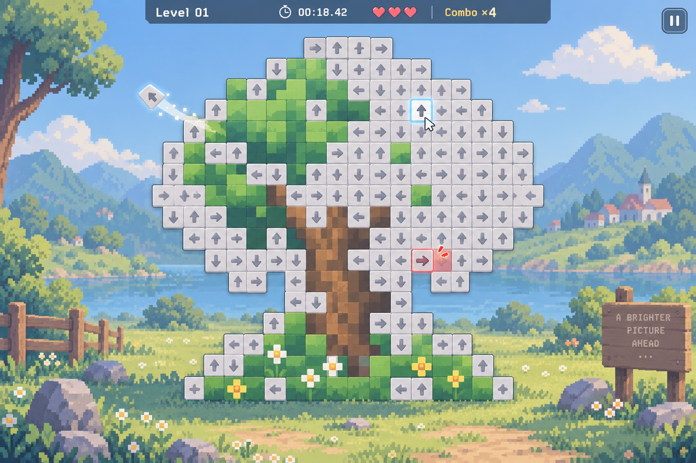
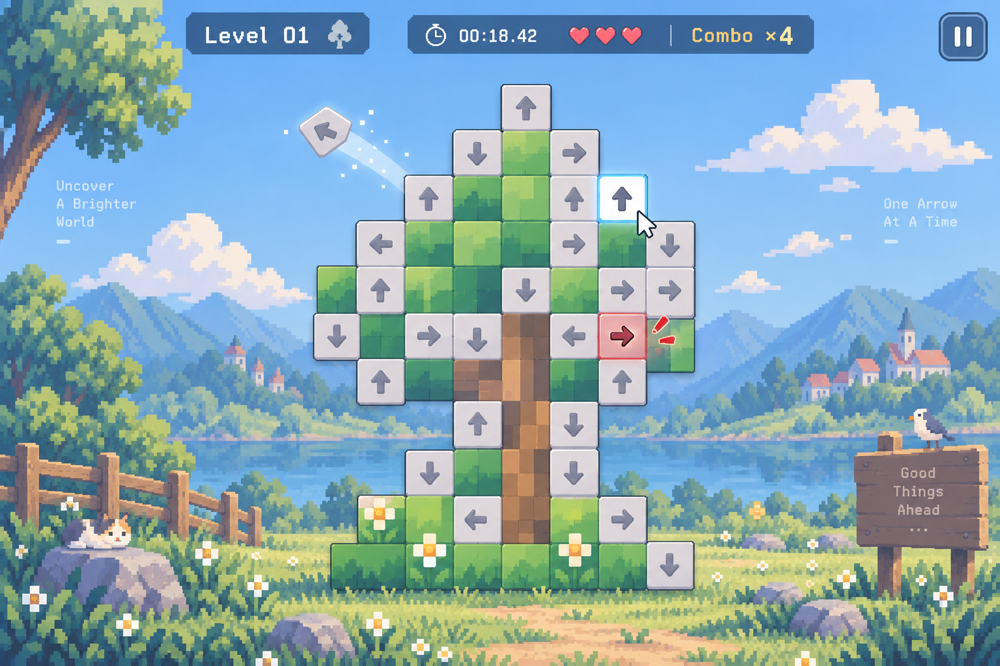

## 2026-09-18 需求分析

问题：
如何处理箭头飞行动画期间的玩家输入？

AI 初始建议：
动画期间锁定棋盘。

人工分析：
试玩原游戏后发现，其允许连续操作，只要操作顺序合法。

最终方案：
箭头成功点击后立即从逻辑棋盘移除，
动画作为独立对象继续运行，因此可以同时存在多个飞行动画。

当然整个PRD文档也是和ai探讨后生成的。

## 2026-09-18 界面提前设计

我这里打算的是先使用image2抽卡，看看有没有好看一点的界面进行借鉴

很好探讨后提示词来了：

```
请设计一张用于实际游戏开发参考的桌面解谜游戏 UI 概念图，主题是一款“一箭又一箭”式的箭头消除游戏。

这不是宣传海报，而是一张完整、清晰、可落地实现的游戏主界面设计稿。重点表现游戏独特的“消除箭头、逐渐显露像素画”机制。

## 核心视觉概念

画面中央是整个游戏最重要的区域：

不是传统的规则棋盘，也不是“空白网格中零散放几个箭头”。

而是一幅由大量单格箭头完整覆盖形成的“像素点阵图”。

每一个有效像素位置上都存在一个箭头，没有空格。

这一关的像素图主题是一棵树。

树冠、树干、草地、小花等区域由一个个像素格组成，因此整个游戏区域的外轮廓不是单纯的正方形，而自然形成一棵像素树的轮廓。

可以存在一个隐藏的逻辑网格作为排列基础，但视觉上不要画成明显的完整方形棋盘框。

下一关未来可以换成花朵、云朵、猫、山峰等不同像素图案，因此需要体现“一关一幅像素画”的设计理念。

## 箭头与隐藏像素机制

每个有效像素格初始都覆盖一个单格箭头。

箭头只有四个方向：
↑ ↓ ← →

箭头本身统一采用浅灰色、灰白色、低饱和淡色，视觉上像覆盖在像素图表面的一层“谜题遮罩”。

不要让箭头本身直接使用最终像素画的鲜艳颜色。

每个箭头下面隐藏着真正的像素颜色。

当箭头被成功消除后：

该位置不再显示箭头，而显露下面原本隐藏的彩色像素块。

因此游戏过程中会出现一种非常重要的视觉状态：

一部分区域仍然覆盖着大量浅灰箭头，
另一部分已经被玩家消除，露出了蓝色、绿色、棕色、黄色等真正的像素颜色。

让玩家明显感觉到：
“我正在通过解谜，一点一点把一幅像素画揭出来。”

这一张设计稿请表现一个已经完成大约 30%～40% 的中途状态，以便清楚展示“灰色箭头区域”和“已显露彩色像素区域”的区别。

例如：
树的一部分树冠已经显露为绿色像素，
树干露出部分棕色，
地面露出少量绿色和黄色花朵，
但大部分位置仍然被浅灰箭头覆盖。

## 箭头交互状态

在保持画面整洁的前提下，可以轻微表现少量交互状态：

1. 普通箭头：
浅灰或灰白色，安静覆盖在像素格上。

2. Hover 状态：
鼠标悬停的箭头可以轻微变亮、抬起或出现柔和描边。

3. 成功飞出：
有一个箭头正在沿自身方向离开像素图区域，
带有非常克制、流畅的运动轨迹，
箭头离开后原位置显露出真正的彩色像素。

4. 错误操作：
可以有一个箭头因为前方存在另一个箭头而短距离向前碰撞，
出现红色或橙红色警示反馈，
体现“撞到其他箭头后再退回原位”的感觉。

不要让整张图同时充满大量动画效果，只需要少量案例表达交互即可。

## 场景融合

整体画面采用温柔、清新的像素风背景。

中央这棵由谜题组成的像素树，不应该像一个生硬贴在界面中央的独立方框。

希望它与周围环境产生一定融合：

例如：
中央谜题是一棵树，
背景中可以自然延续草地、天空、小石块、远处像素云朵等元素，
让完成后的像素画感觉像是整个场景的一部分。

但注意：
谜题本身依然必须清楚可辨，
不能因为背景融合导致箭头看不清。

背景应该比谜题主体更柔和、更淡，
让视觉焦点始终集中在中央的箭头像素画。

整体感觉类似：
“一个安静的小像素世界，中间有一块等待玩家逐渐恢复颜色的场景。”

## UI 布局

采用简洁的桌面游戏单屏布局。

顶部信息栏保持非常克制：

左侧：
Level 01

中间：
计时器，例如 00:18.42

可以显示：
3 个生命值图标

可以保留一个较小的：
Combo ×4

不要让顶部信息过于巨大。

右上角放置一个简洁的暂停按钮：
圆形或圆角方形图标，内部是“Ⅱ”。

主界面中不要直接显示 Restart 和 Menu 两个大型按钮。

Restart、重新开始、返回主菜单、继续游戏等操作应该在点击暂停按钮后出现的暂停菜单中处理。

当前截图是正常游戏状态，因此只需要显示暂停按钮，不展开暂停菜单。

## UI 风格

整体风格：

- 温柔像素风
- 简洁
- 清新
- 轻量
- 有独立游戏感
- 可爱但不幼稚
- 有适量留白
- 不要复杂拟物
- 不要手游商城式 UI
- 不要大量卡片
- 不要复杂侧边栏

像素背景可以有一定艺术感，
但 UI 信息本身保持现代、克制、容易实现。

箭头可以不是传统硬边像素箭头，
可以略微圆润、柔和，
与背景的像素美术形成“现代 UI + 像素场景”的融合。

## 视觉层级

第一视觉焦点：
中央由大量箭头组成的树形像素谜题。

第二视觉焦点：
已经消除箭头后逐渐显露出来的彩色像素区域。

第三视觉焦点：
顶部非常简洁的游戏状态信息。

背景和装饰不得抢过谜题主体。

## 关键设计原则

这张图最重要的不是表现“普通棋盘游戏”。

而是让人第一眼理解：

“这幅灰白色箭头组成的东西，实际上隐藏着一幅彩色像素画；随着箭头被不断消除，真正的画面会一点点显露出来。”

请特别突出这种“逐渐揭晓像素画”的成就感和视觉反馈。

## 严格避免

不要生成：
- 标准 6×6 / 7×7 正方形棋盘
- 空白棋盘中零散几个箭头
- 大量没有箭头的空格
- 箭头本身直接组成鲜艳彩色像素画
- 每个箭头颜色五颜六色
- 长箭头
- 曲折箭头
- 连线箭头
- 不规则弯曲箭头
- 大型 Restart 按钮
- 大型 Menu 按钮
- 复杂右侧信息栏
- 星级说明面板
- 教程文字
- 吉祥物
- 猫咪角色
- 商城元素
- 手机游戏界面
- 宣传海报构图

最终效果应该像一张真正可以用于 Python / Pygame 游戏开发参考的高质量主界面 UI 概念稿。
```

生成结果：

这一版像素·太多了



这一版好一些

